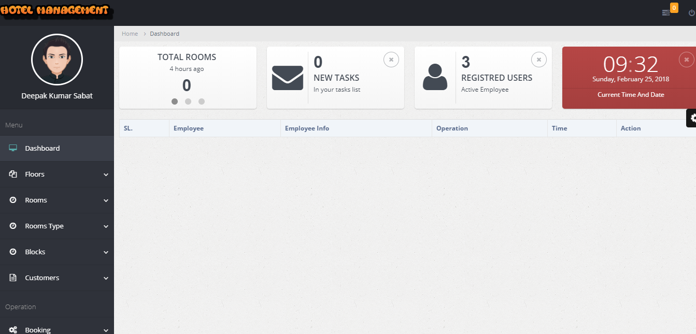
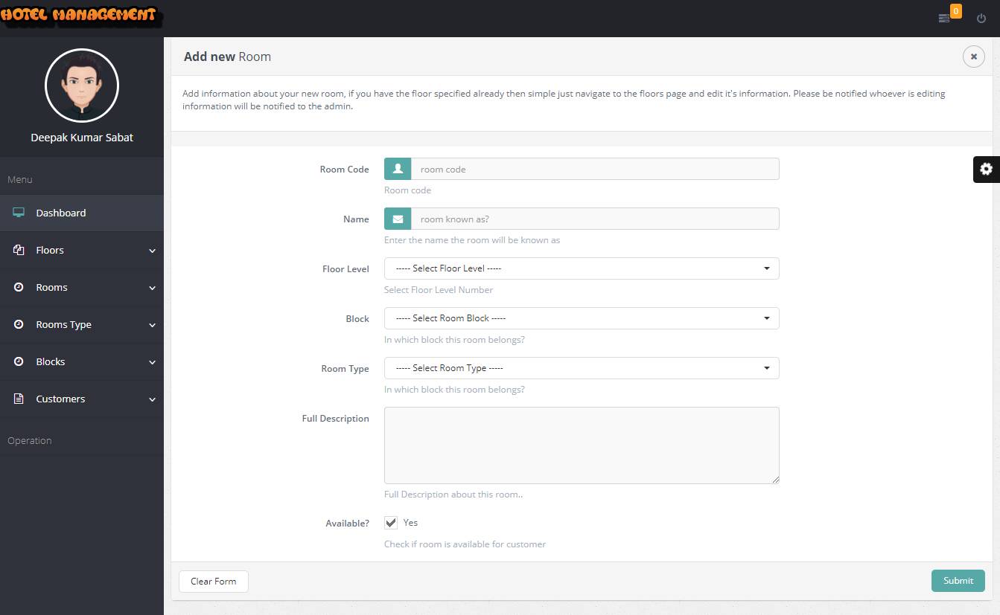
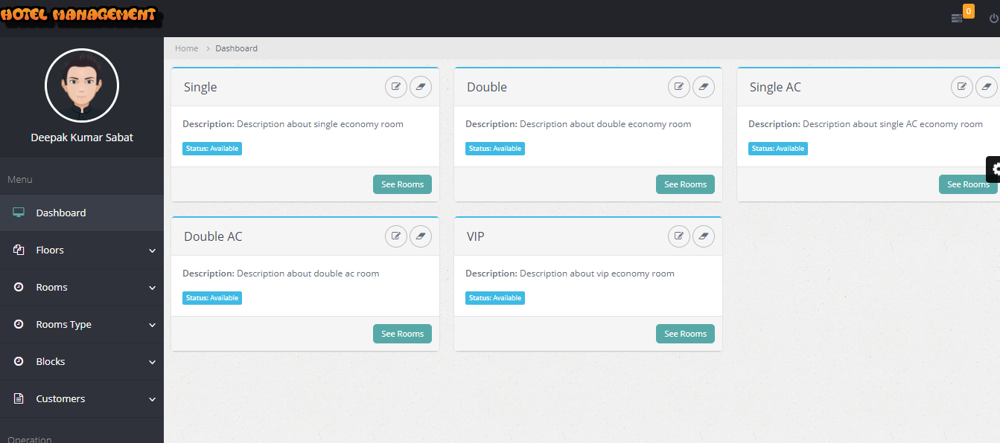

# Laravel PHP Framework

Laravel is a web application framework with expressive, elegant syntax. We believe development must be an enjoyable, creative experience to be truly fulfilling. Laravel attempts to take the pain out of development by easing common tasks used in the majority of web projects, such as authentication, routing, sessions, queueing, and caching.

Laravel is accessible, yet powerful, providing tools needed for large, robust applications. A superb inversion of control container, expressive migration system, and tightly integrated unit testing support give you the tools you need to build any application with which you are tasked.

## How to install

This project requires php 7. Follow the steps below to run this project successfully,

1. Install PHP7 and Latest available stable mysql
2. create a databased named "hotelmanagement"
3. edit .env file and config/database.php file according to database connection configuration
4. To avoid any accidental errors please clear cache by running this command on the root directory "php artisan config:cache" [ must ]
5. now you will have to migrate the saved table structure, to migrate run the following command on the project root directory "php artisan migrate" [must]
6. Now you will have to seed some saved data to the database, run this command "php artisan db:seed" [must]
7. Login to the control panel
		email: root@email.com
		password: 123456
		
#Screenshot

## Official Documentation

Documentation for the framework can be found on the [Laravel website](http://laravel.com/docs).

## Contributing

Thank you for considering contributing to the Laravel framework! The contribution guide can be found in the [Laravel documentation](http://laravel.com/docs/contributions).

## Security Vulnerabilities

If you discover a security vulnerability within Laravel, please send an e-mail to Taylor Otwell at taylor@laravel.com. All security vulnerabilities will be promptly addressed.

## License

The Laravel framework is open-sourced software licensed under the [MIT license](http://opensource.org/licenses/MIT).
